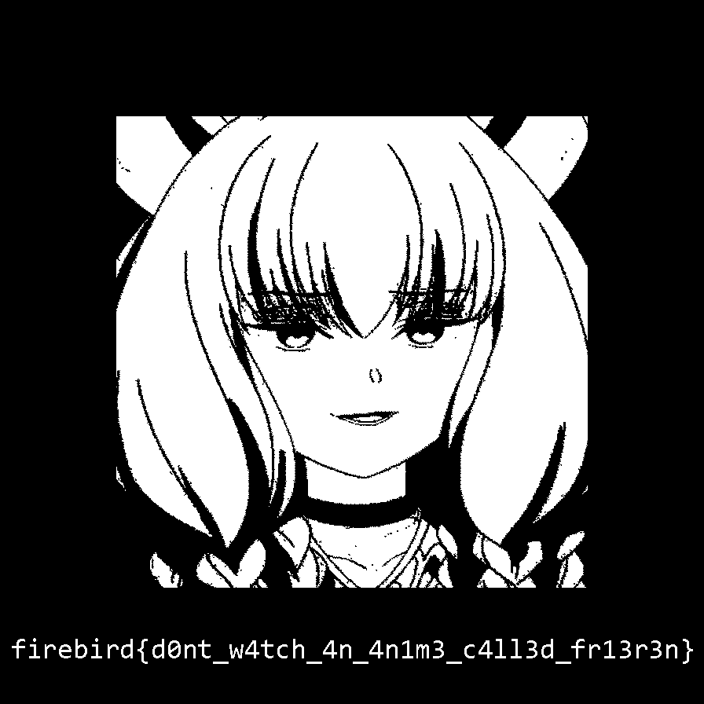
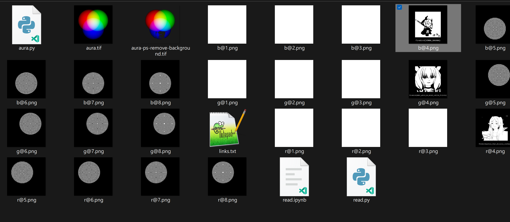

# Aura

> - Link: <https://ash.firebird.sh/challenges?id=19>
> - Author: GonJK
> - Category: Forensics
> - Points: 909
> - Solves: 4

Are you kidding, LSB is a great demon who has lived for more than 500 years!

[aura.tif](attachments/aura.tif)

## Solution

Extract the 4th least significant bit of the green channel as a black and white image. This results in the following image:



Transcribe the flag in the image to get `firebird{d0nt_w4tch_4n_4n1m3_c4ll3d_fr13r3n}`.

## Process

The description mentions "LSB", which stands for [least significant bits](https://en.wikipedia.org/wiki/Bit_numbering#Least_significant_bit_in_digital_steganography). It can be used to hide messages in an image without visibly altering the appearance of the image. It works by altering the least significant bits of the image data, so the value of the image data only changes too slightly to be seen.

First, obtain some basic information about the image. `ffprobe` suffices for this one:

```shell
$ ffprobe -hide_banner aura.tif
Input #0, tiff_pipe, from 'aura.tif':
  Duration: N/A, bitrate: N/A
  Stream #0:0: Video: tiff, rgb48le, 896x896, 25 fps, 25 tbr, 25 tbn
```

The important metadata (and really the only metadata) here is that the color format is `rgb48le`. It means each pixel has 48 bits of data (`48`), composed of a red, green, and blue channel (`rgb`), with the bytes in little endian order (`le`). We can infer that the image is 16-bit, i.e. each channel of a pixel is represented by a 16-bit integer. Hence the range of the color values is [0, 65535].

Here comes the most difficult part: Realizing the implications for LSB of the image being 16-bit. Most images are 8-bit only, so the range is [0, 255], where 0 represents minimum brightness (black) and 255 represents maximum brightness (white). You can only alter the 2 least significant bits without visibly affecting the image. For our 16-bit image, 0 represents minimum brightness and 65535 represents maximum brightness, so one can alter the 4 least significant bits.

So in this case, extract the 4 least significant bits (we actually did 8 bits) with the following Python code:

```Python
import cv2

image = cv2.imread("aura.tif", cv2.IMREAD_UNCHANGED)
for bits in range(4):
    for idx, clr in enumerate("bgr"):
        cv2.imwrite(f"{clr}@{bits + 1}.png", (image[:, :, idx] & 2 ** bits) * (256 / 2 ** bits))
```

Then all is obvious:



3 images seemingly have the flag. It is not too difficult to find the real flag as the other 2 fake flags do not have the format `firebird{...}`.

Of course, one could skip most of the above reasoning by simply extracting all the 16 bits and use less time on this challenge... 🫠

## Alternatives

- Crank the exposure of [aura.tif](attachments/aura.tif) up to maximum with your choice of photo editor.
